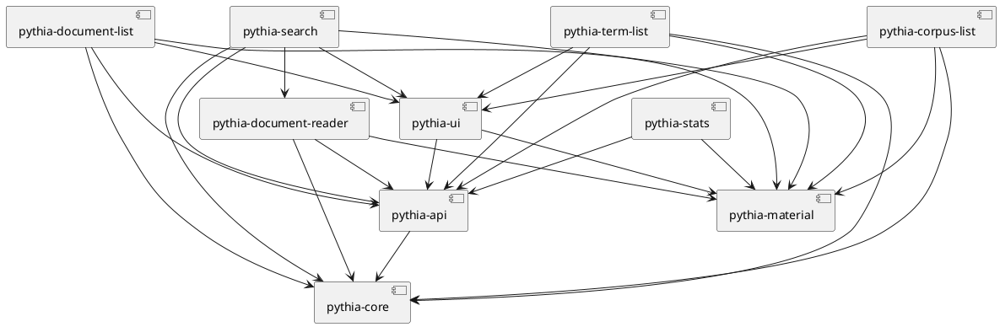

# Pythia

Pythia frontend demo.

This project was generated with [Angular CLI](https://github.com/angular/angular-cli) version 12.1.4.



## Docker

Quick Docker image build:

1. `npm run build-lib`
2. update version in `env.js` and `ng build --configuration production`
3. `docker build . -t vedph2020/pythia-app:0.0.2 -t vedph2020/pythia-app:latest` (replace with the current version).

Note: The official [postgres image](https://hub.docker.com/_/postgres/) will import and execute all SQL files placed in that folder. So something like:

```yaml
services:
  postgres:
    environment:
      POSTGRES_DB: my_db_name
      POSTGRES_USER: my_name
      POSTGRES_PASSWORD: my_password
  volumes:
    - ./devops/db/dummy_dump.sql:/docker-entrypoint-initdb.d/dummy_dump.sql
```

will automatically populate the specified POSTGRES_DB for you.

## History

- 2022-06-26: upgraded Angular to 14 and refactored forms into typed.

### 0.0.1

- 2022-05-04: upgraded Angular to 13.3.5.
- 2022-04-18: upgraded Angular to 13.3.3 and added Docker files.
- 2022-03-11: upgraded Angular to 13.2.6.
