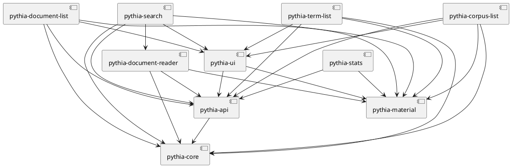

# Pythia

- [Pythia](#pythia)
  - [Docker](#docker)
    - [Restoring Database in Container](#restoring-database-in-container)
  - [History](#history)
    - [0.0.3](#003)
    - [0.0.2](#002)
    - [0.0.1](#001)

Pythia frontend demo.

This project was generated with [Angular CLI](https://github.com/angular/angular-cli) version 12.1.4.



## Docker

Quick Docker image build:

1. `npm run build-lib`
2. update version in `env.js` and `ng build --configuration production`
3. `docker build . -t vedph2020/pythia-app:0.0.3 -t vedph2020/pythia-app:latest` (replace with the current version).

### Restoring Database in Container

The official [postgres image](https://hub.docker.com/_/postgres/) will import and execute all SQL files placed in a specific folder. So something like:

```yaml
services:
  postgres:
    environment:
      POSTGRES_DB: my_db_name
      POSTGRES_USER: my_name
      POSTGRES_PASSWORD: my_password
  volumes:
    - ./devops/db/dummy_dump.sql:/docker-entrypoint-initdb.d/dummy_dump.sql
```

will automatically populate the specified POSTGRES_DB for you. You can create a dump of your Pythia database, prepend to it instructions to create and select it, and then place it in that folder. The procedure is as follows:

(1) in `docker-compose.yml` file, add to the `postgres` service a volume pointing to your dump file. In this example, the file is named `pythia.sql` and was placed in a Ubuntu host under `/opt`.

```yaml
volumes:
  - /opt/pythia.sql:/docker-entrypoint-initdb.d/pythia.sql
```

(2) in the machine where you have your Pythia database to import in the image consumer machine, create your dump like this (the sample refers to a Windows OS):

```ps1
./pg_dump --username=postgres -f c:\users\dfusi\desktop\pythia.sql pythia
```

(3) ensure that your dump file starts with the instructions to create and select the `pythia` database:

```sql
-- prepend these commands:
CREATE DATABASE pythia WITH TEMPLATE template0 OWNER postgres;
\c pythia

-- dump follows here ...
```

## History

- 2022-11-05: updated Angular.
- 2022-09-02: fix to document filters attributes.

### 0.0.3

- 2022-07-31: updated packages.

### 0.0.2

- 2022-07-10: upgraded Angular.
- 2022-06-26: upgraded Angular to 14 and refactored forms into typed.

### 0.0.1

- 2022-05-04: upgraded Angular to 13.3.5.
- 2022-04-18: upgraded Angular to 13.3.3 and added Docker files.
- 2022-03-11: upgraded Angular to 13.2.6.
