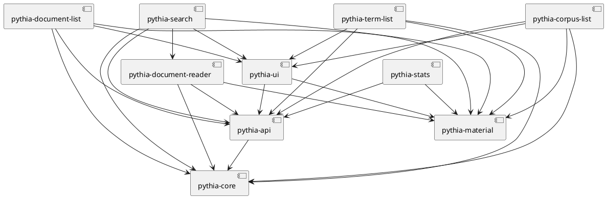

# Pythia

Pythia frontend demo.

This project was generated with [Angular CLI](https://github.com/angular/angular-cli) version 12.1.4.

```plantuml
@startuml
[pythia-api] --> [pythia-core]
[pythia-corpus-list] --> [pythia-core]
[pythia-corpus-list] --> [pythia-api]
[pythia-corpus-list] --> [pythia-material]
[pythia-corpus-list] --> [pythia-ui]
[pythia-document-list] --> [pythia-core]
[pythia-document-list] --> [pythia-api]
[pythia-document-list] --> [pythia-material]
[pythia-document-list] --> [pythia-ui]
[pythia-document-reader] --> [pythia-core]
[pythia-document-reader] --> [pythia-api]
[pythia-document-reader] --> [pythia-material]
[pythia-search] --> [pythia-core]
[pythia-search] --> [pythia-api]
[pythia-search] --> [pythia-material]
[pythia-search] --> [pythia-document-reader]
[pythia-search] --> [pythia-ui]
[pythia-stats] --> [pythia-api]
[pythia-stats] --> [pythia-material]
[pythia-term-list] --> [pythia-api]
[pythia-term-list] --> [pythia-core]
[pythia-term-list] --> [pythia-material]
[pythia-term-list] --> [pythia-ui]
[pythia-ui] --> [pythia-api]
[pythia-ui] --> [pythia-material]
@enduml
```

## History

- 2022-03-11: upgraded Angular to 13.2.6.
